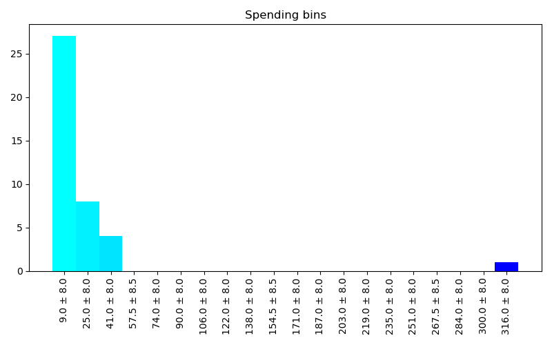
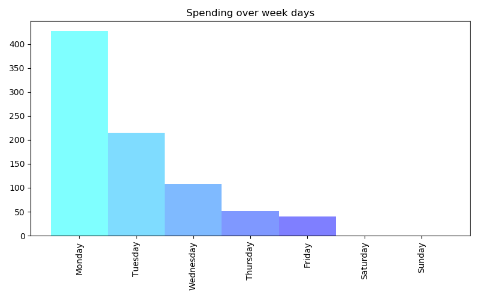
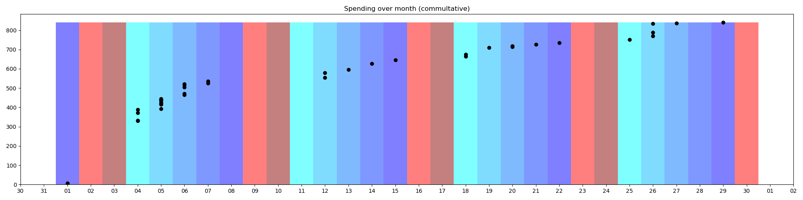

# BankingViz
BankingViz is an CLI application for generating visual reports from banking information.

## Reports
Follwing reports can be generated:





## Supported banking information
We currently support follow banking data:
- Sparkasse CAMT .csv files in german [sparkasse_csv_camt_german]

## How to use it

First you need to generate a readable .csv file for the visualizer to read. In this case we use 
the [sparkasse_csv] converter to convert a Sparkasse .csv file into a readable .csv format. An
example sparkasse csv file will be provided at examples/sparkasse_csv.csv:
```Shell
python -m converter.sparkasse_csv_camt_german --source examples/sparkasse_csv_camt_german.csv --destination data/sparkasse/converted.csv
```

After converting, the visualizer can read the converted file. The files will be generated in data/sparkasse:
```Shell
python -m visualizer --source data/sparkasse/converted.csv --dest_dir data/sparkasse/
```

This two steps can be summarized in one command:
```Shell
python -m bankingviz --converter sparkasse_csv_camt_german --sources examples/sparkasse_csv_camt_german.csv --project_name sparkasse
```